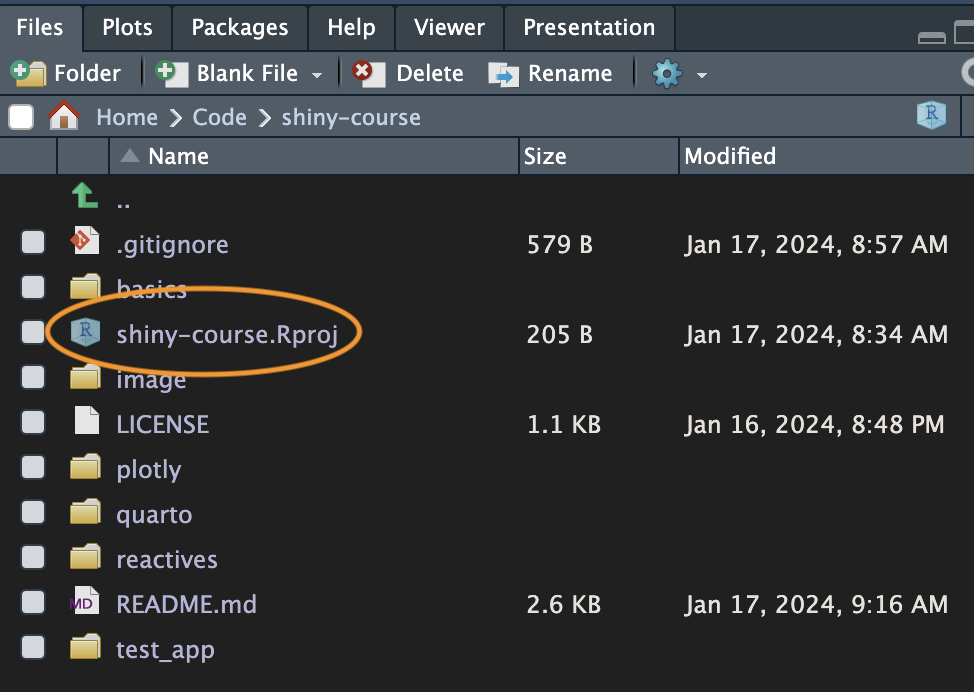

# Shiny Course

## Welcome to the Course!

My name is Ted Laderas and I'll be guiding you through this introductory course on Shiny.

I'm really excited to help introduce you to one of the most powerful interactive visualization frameworks out there. There are a lot of exciting things you can do with Shiny including building interactive graphs and maps.

I also want to remind you to be patient with yourself as you go through the material. A lot of things may not be immediately apparent, but keep at it. It's worth it.


## Installation Instructions 

In RStudio, first install the following packages with 

```r
install.packages("remotes")
install.packages("shiny")
install.packages("fivethirtyeight")
install.packages("plotly")
install.packages("usethis")
```

To download the course materials, you then run:

```r
library(usethis)
use_course("rfortherestofus/shiny-course")
```

It will ask you if you want to download the course into a specific folder. If you don't like that folder, you can specify a different location using the `destdir` argument. For example, if I wanted to install it into my `Code/` folder in `/Users/tedladeras/`:

```r
usethis::use_course("rfortherestofus/shiny-course", destdir="/Users/tedladeras/Code/")
```

You'll need to pick the option that means "yes" (the prompt is to make sure that you're paying attention to the questions, the order is switched up every time.)


It will then ask you if you want to delete the Zip file. You don't need this, so select the option that means "yes" again:


Now you should be ready for the course. Let's do a quick check to make sure that we're up and running:

```r
library(shiny)
runApp("test_app")
```

If everything is successful, you should see a window open up:


Confirm the app works by moving the slider, and then close the window. You should be all set up for the course.

## Opening the Project Later

There are two ways to reopen the project. The first is to open the project selector in the top right of the RStudio window. There you can select the project (it will have a slightly different name - the last part will be different):


The other is to open the `shiny-course.Rproj` file in your file explorer or finder:



## Resetting the course

In case you accidentally delete things, you can download a new copy with course materials using `use_course()` again. It will download a fresh copy as a new project. The old project will remain, with a new id:

```r
library(usethis)
use_course("rfortherestofus/shiny-course")
```

## Organization of the Course Materials

There are four folders corresponding to the four parts of the course. In order, these are:

```
basics/
reactives/
plotly/
quarto/
```

When you watch the "Your Turn" section of the videos, you'll open the corresponding assignment number in the corresponding folder (it will make more sense when you start watching the videos).

Sometimes the assignments will be about adding code to an existing shiny app, or thinking through a particular question.

Hope you enjoy the course! 